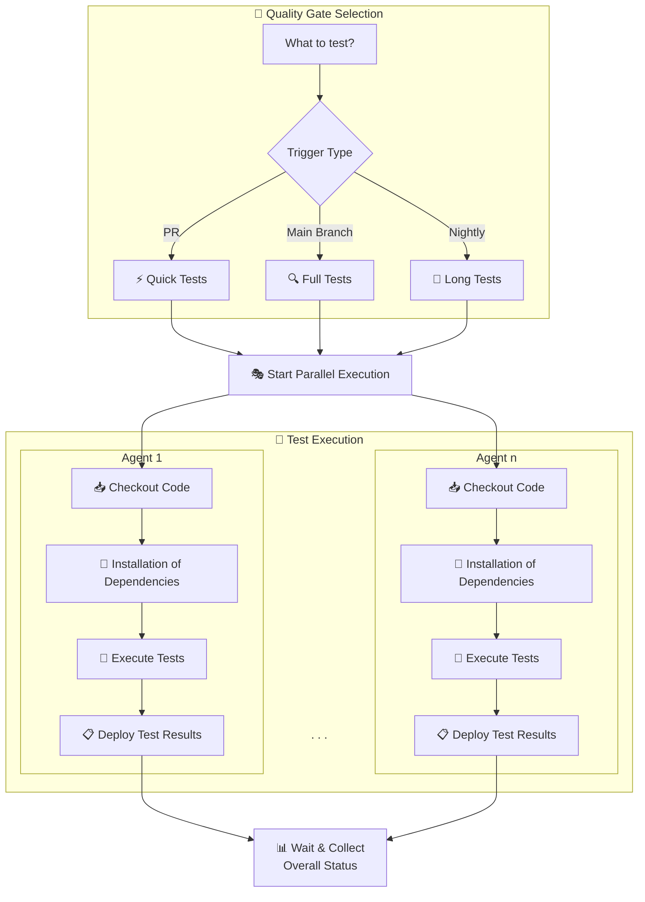

# Testautomatisierung in der Automobilindustrie: Vom Jenkinstein zur wartbaren Testplattform

Karsten Günther, Alexandru Maxiniuc - Marquardt GmbH

## Vorspann

Testautomatisierung über alle Teststufen hinweg ist in der Automobilindustrie unverzichtbar. Doch was passiert, wenn die gesamte Testlogik in CI-Pipeline-DSL implementiert wird? In diesem Beitrag berichten wir aus 20 Jahren Praxis in der Embedded-Softwareentwicklung, wie wir von einem monolithischen "Jenkinstein" - tausenden Zeilen Groovy-Code, der Build-, Test- und Deployment-Logik vermischte - zu einer modularen Testplattform auf Basis von Python und Pytest gefunden haben. Der Schlüssel: Quality Gates als einfache Pytest-Marker-Selektion, die lokal und in CI identisch funktionieren.

## Das Problem: Testlogik am falschen Ort

Unsere CI-Reise begann 2005 in der Automobilzulieferindustrie. Der Ausgangspunkt war ernüchternd: Kein einziger Unit-Test im Repository. Getestet wurde explorativ am Target - im Labor mit Messtechnik und Oszilloskop oder direkt im Fahrzeug. Keine Testautomatisierung, nur Nightly Builds mit dem höchsten Qualitätskriterium "Software linkbar". Wir nannten diesen Zustand "Continuous Kind im Brunnen" - reaktiv statt präventiv.

Die ersten Verbesserungsversuche brachten Unit-Tests auf Basis eines eigenen CUnit-Frameworks und Jenkins als CI-Server. Doch mit wachsenden Anforderungen - SIL-Tests (Software-in-the-Loop), HIL-Tests (Hardware-in-the-Loop), statische Codeanalyse - entstand eine fatale Entwicklung: Für jede Testart wurde ein eigener Jenkins-Freestyle-Job erstellt, später wurden diese in immer komplexere Groovy-Pipelines konsolidiert.

Das Ergebnis war unser "Jenkinstein": Ein Monster aus zehntausenden Zeilen Jenkins-Pipeline-DSL, das als Buildsystem, Testsystem, Deploymentsystem und Monitoringsystem gleichzeitig fungierte. Die Pipeline enthielt die gesamte Geschäftslogik - welche Varianten gebaut werden, welche Tests für welche Teststufe laufen, wie Ergebnisse aggregiert werden. Shared Libraries und Plugins machten das Chaos komplett.

Die Konsequenzen waren gravierend:

- **Nicht reproduzierbare Testergebnisse**: Fehler, die in CI auftraten, konnten lokal nicht nachgestellt werden, weil die Testlogik nur in der Pipeline existierte.
- **Unwartbarer Code**: Groovy-DSL-Code in Jenkins ist schwer testbar, schwer zu debuggen und für die meisten Entwickler unverständlich.
- **Hoher Wartungsaufwand**: Zwei Scrum-Teams waren zu mindestens 50% mit der Pflege der Pipelines beschäftigt.
- **Kein Shift Left**: Entwickler konnten Quality Gates nicht lokal ausführen und erhielten Feedback erst nach dem Push.

## Die Erkenntnis: CI und lokal unterscheiden sich nur in der Orchestrierung

Der Wendepunkt kam mit einer simplen Erkenntnis: CI-Umgebungen und lokale Entwicklermaschinen unterscheiden sich primär in der *Orchestrierung*, nicht in der eigentlichen Test- und Build-Ausführung. Ein Build, ein Unit-Test, eine statische Analyse - all das sollte mit denselben Kommandos funktionieren, egal ob lokal oder auf einem CI-Agent.

Daraus leiteten wir fünf Architekturprinzipien ab:

1. **Separation of Concerns**: Die Pipeline orchestriert nur - keine Geschäftslogik in Pipeline-DSL.
2. **Local-First Development**: Jenkins führt exakt dieselben Kommandos aus, die Entwickler lokal nutzen.
3. **Bootstrapping**: Build-Skripte lösen alle Abhängigkeiten selbst auf.
4. **Unified Build System**: CMake als Meta-Buildsystem für alle Varianten und Artefakte.
5. **Quality Gates als Testselektion**: Verschiedene Teststufen sind lediglich unterschiedliche Pytest-Marker-Selektionen.

## Die Lösung: Pytest als universelles Test-Framework

Das Herzstück unserer Lösung ist die Nutzung von Pytest als universelles Test-Framework für *alle* Quality Gates - vom Build über Unit-Tests bis hin zu Integrationstests. Jede Teststufe wird durch einen Pytest-Marker repräsentiert:

```python
class Test_MyVariant:
    variant = "MyVariant"

    @pytest.mark.build
    def test_build(self):
        spl_build = SplBuild(variant=self.variant,
                             build_kit="prod", target="build")
        result = spl_build.execute()
        assert result == 0, "Build fehlgeschlagen"

    @pytest.mark.unittests
    def test_unittests(self):
        spl_build = SplBuild(variant=self.variant,
                             build_kit="test", target="unittests")
        result = spl_build.execute()
        assert result == 0, "Unit-Tests fehlgeschlagen"
```

Die Quality-Gate-Auswahl erfolgt dann durch den Trigger-Typ:

- **Pull Request**: `pytest -m "build or unittests"` - schnelle Tests für schnelles Feedback
- **Develop-Branch**: `pytest -m "build or unittests or integration"` - vollständige Testsuite
- **Nightly Build**: `pytest -m "build or unittests or integration or longrunning"` - inklusive langläufiger Tests

Damit werden Quality Gates von undurchsichtiger Pipeline-Magie zu transparenten, reproduzierbaren Testselektionen. Ein Entwickler, der einen Fehler im CI nachstellen möchte, führt lokal exakt denselben Pytest-Aufruf aus - kein Pipeline-Debugging, kein "works on my machine".

*Abbildung 1: SPLE-Pipeline mit Quality-Gate-Selektion und paralleler Testausführung. Quelle: eigene Darstellung*



## Der Technologie-Stack

Unsere SPLE-Plattform (Software Product Line Engineering) setzt auf einen bewusst schlanken Stack:

- **Scoop**: Windows-Paketmanager für die automatische Installation aller Toolchains - kein manuelles Setup, kein "bei mir fehlt Tool X".
- **CMake + Ninja**: CMake als Meta-Buildsystem generiert performante Ninja-Build-Dateien für alle Varianten. Ein einheitliches Buildsystem statt fragmentierter Makefiles.
- **Python + Pytest**: Alle Quality Gates sind Pytest-Tests mit Markern. Die Testlogik ist wartbarer Python-Code statt Groovy-DSL.
- **Pypeline**: Unser CI-agnostischer Pipeline-Runner. Pipeline-Schritte werden als Python-Klassen implementiert und in einer YAML-Datei konfiguriert - dieselbe Pipeline läuft auf dem Entwickler-Laptop, in Jenkins und in GitHub Actions.
- **Jenkins**: Nur noch dünne Orchestrierungsschicht. Der Jenkinsfile ist minimal - er ruft Pytest mit den passenden Markern auf, mehr nicht.

Das Entscheidende ist die konsequente Trennung: Die Pipeline weiß *wann* und *wo* Tests laufen (Orchestrierung), aber nicht *was* und *wie* getestet wird (Geschäftslogik).

## Ehrliche Learnings: Was wir dabei gelernt haben

**Das "Law of the Instrument" ist real.** Wer einen Hammer hat, für den sieht alles wie ein Nagel aus. Jenkins ist ein hervorragendes Orchestrierungswerkzeug, aber kein Buildsystem und kein Test-Framework. Wir haben Jahre gebraucht, um diese Grenze zu erkennen und konsequent einzuhalten.

**Separate Repositories für Pipeline und Produktcode sind ein Anti-Pattern.** Wenn die CI-Konfiguration in einem eigenen Repository liegt, entsteht eine künstliche Trennung, die Reproduzierbarkeit unmöglich macht. Pipeline-als-Code gehört ins Produktrepository.

**Testautomatisierung muss lokal funktionieren.** Der wichtigste Qualitätsindikator einer Testautomatisierung ist die Frage: "Kann ein Entwickler diesen Test auf seiner Maschine ausführen?" Wenn die Antwort "Nein" lautet, stimmt die Architektur nicht.

**Die Plattform als Produkt behandeln.** Der größte organisatorische Hebel war, unsere Testplattform als eigenes Produkt innerhalb eines Agile Release Train (SAFe) zu entwickeln. Regelmäßige Sprint Reviews mit echtem Nutzerfeedback, dediziertes Budget von der Geschäftsleitung und ein klarer Produktname schaffen Ownership und Nachhaltigkeit.

## Fazit und Ausblick

Die Transformation vom Jenkinstein zur modularen Testplattform hat sich für alle Beteiligten gelohnt. Entwickler erhalten schnelles, lokal reproduzierbares Feedback. Plattform-Ingenieure pflegen wartbaren Python-Code statt tausender Zeilen Groovy-DSL. Das Management hat transparente Qualitätskriterien und einen stets releasefähigen Softwarestand.

Der Schlüssel lag nicht in einem neuen Tool, sondern in einer architektonischen Entscheidung: Testlogik gehört nicht in die Pipeline. Pytest-Marker als Abstraktion für Quality Gates sind einfach, transparent und universell - vom Unit-Test bis zum Systemtest, von der Entwicklermaschine bis zum CI-Server.

## Referenzen

[1] Pytest: https://docs.pytest.org/en/

[2] CMake: https://cmake.org/

[3] Jenkins Pipeline Best Practices: https://www.jenkins.io/doc/book/pipeline/pipeline-best-practices/

[4] Internal Developer Platform: https://internaldeveloperplatform.org/

[5] Scoop Windows Package Manager: https://scoop.sh/

[6] Scaled Agile Framework (SAFe): https://www.scaledagileframework.com/

## Kurzbiografie

**Karsten Günther** arbeitet als Senior Platform Engineer bei der Marquardt GmbH im Rhein-Main-Team. Mit über 20 Jahren Erfahrung in der Automobilindustrie - von Embedded C über Build-Systeme bis hin zu CI/CD-Plattformen - konzentriert er sich auf Software Product Line Engineering und Internal Developer Platforms.

**Alexandru Maxiniuc** arbeitet als Senior Platform Engineer bei der Marquardt GmbH im Rhein-Main-Team. Er bringt langjährige Erfahrung in der Embedded-Softwareentwicklung und im Bereich Build-Systeme und Automatisierung in der Automobilbranche mit.
